## Paper List

| Title                                                        |      Venue       | Year |         Modality         |                       Task                       |       New Dataset        |                       Code (&Dataset)                        |  Analysis   |
| ------------------------------------------------------------ | :--------------: | :--: | :----------------------: | :----------------------------------------------: | :----------------------: | :----------------------------------------------------------: | :---------: |
| [Unlocking the Capabilities of Large Vision-Language Models for Generalizable and Explainable Deepfake Detection](https://arxiv.org/abs/2503.14853) |       ICML       | 2025 |       Facial Image       |             Detection, Localization              |            -             |       [GitHub](https://github.com/botianzhe/LVLM-DFD)        | [link](#1)  |
| [BusterX++: Towards Unified Cross-Modal AI-Generated Content Detection and Explanation with MLLM](https://arxiv.org/abs/2507.14632) |      arXiv       | 2025 |      Image / Video       |              Detection, Explanation              |       GenBuster++        |          [GitHub](https://github.com/l8cv/BusterX)           | [link](#2)  |
| [RAIDX: A Retrieval-Augmented Generation and GRPO Reinforcement Learning Framework for Explainable Deepfake Detection](https://arxiv.org/abs/2508.04524) |      ACM'MM      | 2025 |          Image           |        Detection, Explanation (thinking)         |            -             |                        Not Available                         | [link](#3)  |
| [FakeShield: Explainable Image Forgery Detection and Localization via Multi-modal Large Language Models](https://arxiv.org/abs/2410.02761) |       ICLR       | 2025 | (PS/Deepfake/AIGC) Image |       Detection, Explanation, Localization       |         MMTD-Set         |       [GitHub](https://github.com/zhipeixu/FakeShield)       | [link](#4)  |
| [SIDA: Social Media Image Deepfake Detection, Localization and Explanation with Large Multimodal Model](https://arxiv.org/abs/2412.04292) |       CVPR       | 2025 |          Image           |       Detection, Localization, Explanation       |         SID-Set          |          [GitHub](https://github.com/hzlsaber/SIDA)          | [link](#5)  |
| [On Learning Multi-Modal Forgery Representation for Diffusion Generated Video Detection](https://arxiv.org/abs/2410.23623) |     NeurIPS      | 2024 |      Image / Video       |                    Detection                     |           DVF            |     [GitHub](https://github.com/SparkleXFantasy/MM-Det)      | [link](#6)  |
| [AIGI-Holmes: Towards Explainable and Generalizable AI-Generated Image Detection via Multimodal Large Language Models](https://arxiv.org/abs/2507.02664) |       ICCV       | 2025 |          Image           |              Detection, Explanation              |        Holmes-Set        |       [GitHub](https://github.com/wyczzy/AIGI-Holmes)        | [link](#7)  |
| [ALLM4ADD: Unlocking the Capabilities of Audio Large Language Models for Audio Deepfake Detection](https://arxiv.org/abs/2505.11079) |      ACM'MM      | 2025 |          Audio           |                    Detection                     |            -             |   [GitHub](https://github.com/ucas-hao/qwen_audio_for_add)   | [link](#8)  |
| [Spot the Fake: Large Multimodal Model-Based Synthetic Image Detection with Artifact Explanation](https://arxiv.org/abs/2503.14905) |     NeurIPS      | 2025 |          Image           |              Detection, Explanation              |         FakeClue         |       [GitHub](https://github.com/opendatalab/FakeVLM)       | [link](#9)  |
| [VidGuard-R1: AI-Generated Video Detection and Explanation via Reasoning MLLMs and RL](https://arxiv.org/abs/2510.02282) |      arXiv       | 2025 |          Video           |              Detection, Explanation              |         VidGuard         |    [GitHub](https://github.com/kyoungjunpark/VidGuard-R1)    | [link](#10) |
| [Veritas: Generalizable Deepfake Detection via Pattern-Aware Reasoning](https://arxiv.org/abs/2508.21048) |      arXiv       | 2025 |       Facial Image       |              Detection, Explanation              |      HydraFake-100K      |        [GitHub](https://github.com/EricTan7/Veritas)         | [link](#11) |
| [UniShield: An Adaptive Multi-Agent Framework for Unified Forgery Image Detection and Localization](https://arxiv.org/abs/2510.03161) |      arXiv       | 2025 |          Image           |       Detection, Localization, Explanation       |            -             |                        Not Available                         | [link](#12) |
| [MIRAGE: Towards AI-Generated Image Detection in the Wild](https://arxiv.org/abs/2508.13223) |      arXiv       | 2025 |          Image           |              Detection, Explanation              |          MIRAGE          |                        Not Available                         | [link](#13) |
| [FakeScope: Large Multimodal Expert Model for Transparent AI-Generated Image Forensics](https://arxiv.org/abs/2503.24267) |      arXiv       | 2025 |          Image           |         Detection, Explanation, Instruct         | FakeChain & FakeInstruct |      [GitHub](https://github.com/Yixuanli423/FakeScope)      | [link](#14) |
| [LEGION: Learning to Ground and Explain for Synthetic Image Detection](https://arxiv.org/abs/2503.15264) | ICCV (Highlight) | 2025 |          Image           | Detection, Localization, Explanation, Generation |        SynthScars        | [GitHub](https://github.com/opendatalab/LEGION), [HuggingFace Replicate](https://huggingface.co/fanqiNO1/LEGION-8B-replicate) | [link](#15) |
| [ThinkFake: Reasoning in Multimodal Large Language Models for AI-Generated Image Detection](https://arxiv.org/abs/2509.19841) |      arXiv       | 2025 |          Image           |              Detection, Explanation              |            -             |                        Not Available                         | [link](#16) |

---

## Paper Analysis

### 1. Unlocking the Capabilities of Large Vision-Language Models for Generalizable and Explainable Deepfake Detection  
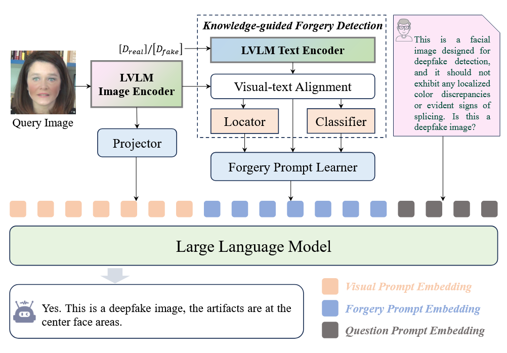 

**模型/方法概述**：  

- 基于LLM（PandaGPT Vicuna-7B）的深度伪造检测框架，融合视觉与伪造特征实现可解释性检测。  

**核心组件/架构**：  

- **三路输入融合**：  
  1. **Visual embedding**：Image Encoder提取的视觉特征  
  2. **Forgery embedding**：KFD+FPL模块生成的伪造特征  
  3. **Question embedding**：用户查询编码  
  
- **KFD (Knowledge-based Forgery Detection)**：  
  
  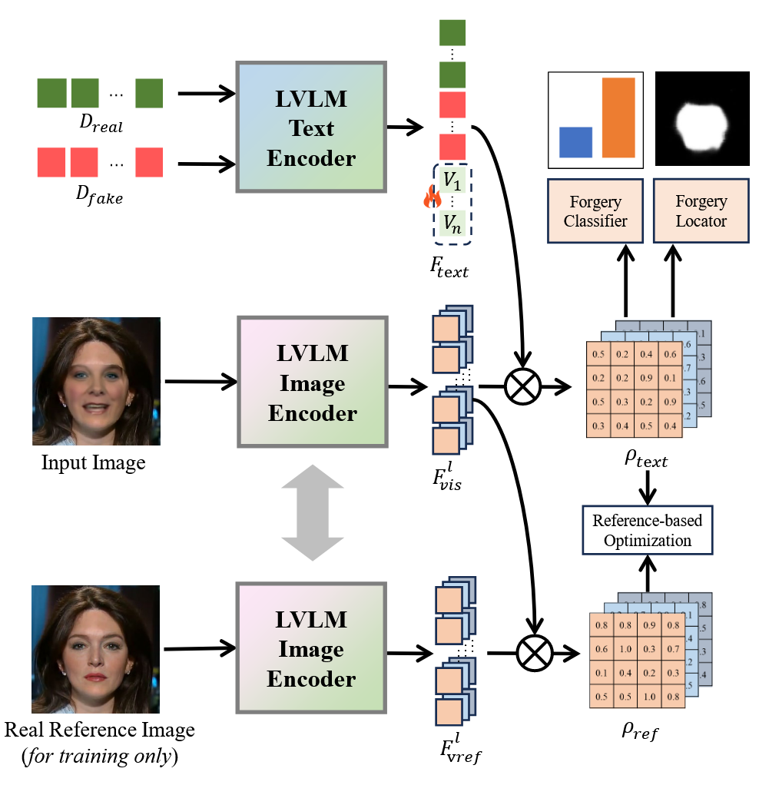
  
  - 采用ImageBind编码器：  
    - *文本分支*：对真实/虚假描述编码，结合可学习嵌入  
    - *图像分支*：提取中间层特征生成特征图  
  - 通过相似度图计算定位伪造区域，三分支定位器生成分割图，三分支分类器输出真实/虚假分数  
  
- **FPL (Forgery Prompt Learning)**：  
  
  - 将分割图、伪造分数和一致性图转换为Forgery embedding  
  - 引入任务特定可学习嵌入增强检测能力  
  
- **微调策略**：结合Prompt Tuning和LoRA，使用模拟图像-文本对定制化微调LLM
  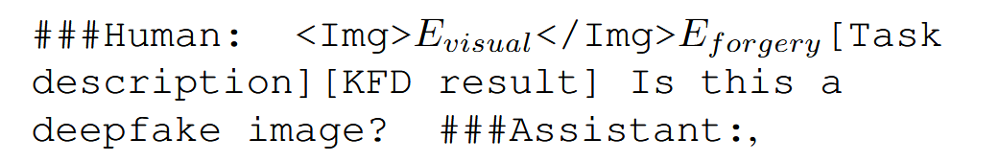

**数据集**：  
开源数据集：FF++，DFD，CDF1，CDF2，DFDCP，DFDC，DF40  

---

### 2. BusterX++: Towards Unified Cross-Modal AI-Generated Content Detection and Explanation with MLLM  
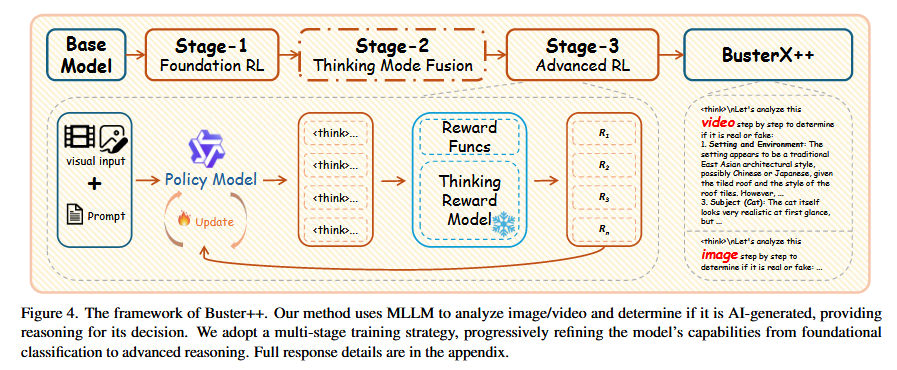

**模型/方法概述**：  

- 基于Chain-of-Thought (CoT) 和强化学习的多模态伪造检测与解释框架。  

**核心组件/架构**：  

- **三阶段训练**：  
  1. **基础RL**：以准确性为奖励信号  
  2. **Thinking Mode Fusion**：在思考/非思考模式间切换进行监督微调（SFT）  
  3. **高级RL**：结合准确性、回答规范性和外部模型评估的思维质量奖励  
- **奖励函数设计**：  
  - 准确性奖励（0/1） 
  - 格式奖励（正确的思考格式 0/1）
  - 软过长惩罚（防止输出过长，给予惩罚） 
  - 模式一致性惩罚：如果在思考/非思考模式下不思考/思考，给予-1惩罚  
  - 思维质量奖励：由SophiaVL-R1-Thinking-Reward-Model-3B评估  
- **实现细节**：使用LoRA进行参数高效微调  

**数据集**：  
**GenBuster++数据集**：高质量少样本数据集，支持检测与解释任务  

---

### 3. RAIDX: A Retrieval-Augmented Generation and GRPO Reinforcement Learning Framework for Explainable Deepfake Detection  
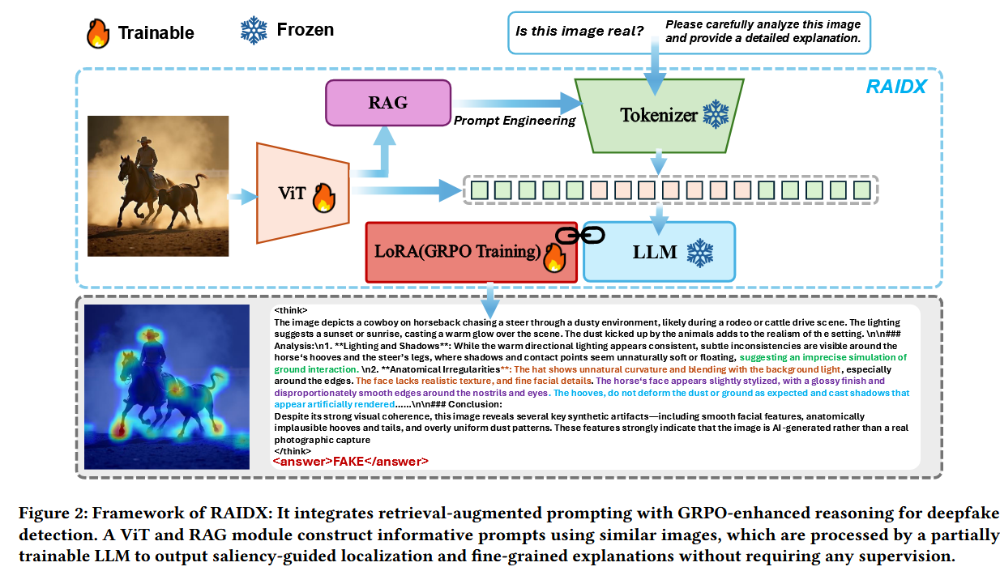

**模型/方法概述**：  

- 结合检索增强生成（RAG）与组相对策略优化（GPRO）的可解释深度伪造检测框架。  

**核心组件/架构**：  
- **双路径特征提取**：  
  
  - ViT生成视觉特征，一路用于RAG检索，一路与文本token融合  
  
- **RAG模块**：  
  
  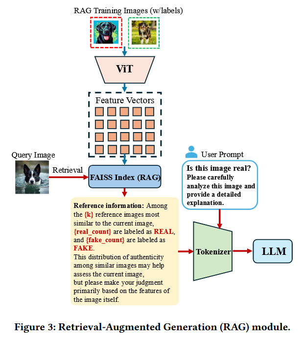
  
  - 使用FAISS构建训练图像向量索引  
  - 检索最相关k个图像，聚合标签生成统计摘要（"k个中有n真m假"）  
  
- **LLM推理**：  

  - *Think块*：分析照明/阴影/边缘/语义不规则性  
  - *Answer块*：输出检测结果  

- **显著性图生成**：聚合ViT各层注意力权重，生成由粗到细的重要性图  

**训练策略**： 

**LoRA+GPRO**

- 奖励 $ r_i $ = 准确性奖励 + 格式奖励  
- 采用组归一化处理奖励分布  

**数据集**：  
开源数据集

---

### 4. FakeShield: Explainable Image Forgery Detection and Localization via Multi-modal Large Language Models  
 
**模型/方法概述**：  

- 多模态伪造检测与定位框架（DTE-FDM），支持PS/Deepfake/AIGC三类伪造内容。  

**核心组件/架构**：  
- **Domain Tag Generator (DTG)**：  
  - 将图像分类为PS/Deepfake/AIGC三类域  
  - 生成域特定prompt文本token  
- **多模态融合**：  
  - 图像编码器 + 线性投影生成图像tokens  
  - LLaVA输出：检测结果、篡改区域描述、判断依据  
- **定位模块 (MFLM)**：  
  - Tamper Comprehension Module (TCM)：将LLaVA生成的描述转换为SAM提示token  
  - SAM解码器生成定位掩码 $ M_{loc} $  

**训练策略**：  
- **分阶段训练**：  
  - DTG：交叉熵损失  
  - LLM：交叉熵损失  
  - TCM：交叉熵损失  
  - MFLM：交叉熵 + Dice loss  

**数据集**：  
**MMTD-Set**（三类伪造样本）：  
- 使用GPT-4o为每张图像生成检测结果、定位描述、判断依据  

- 真实视频仅生成检测结果和依据  

  

---

### 5. SIDA: Social Media Image Deepfake Detection, Localization and Explanation with Large Multimodal Model  
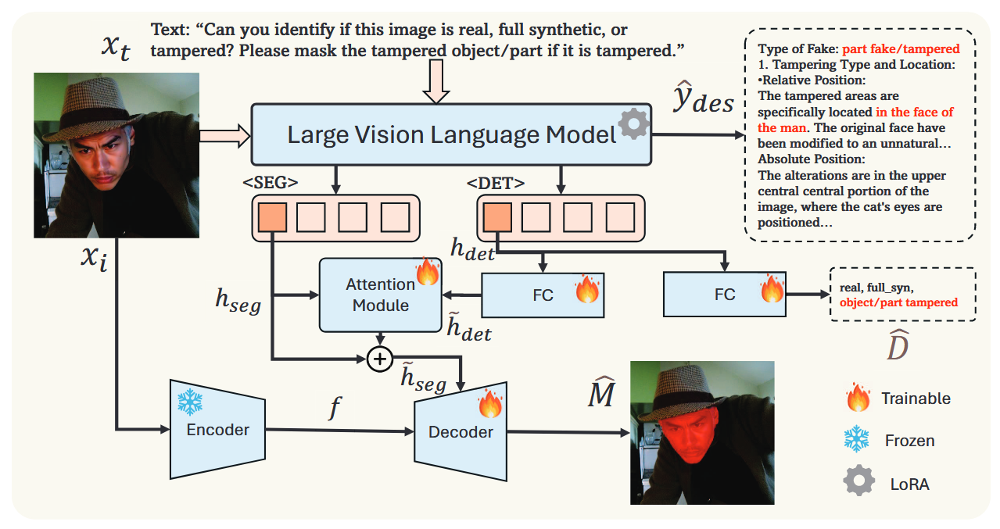 
**模型/方法概述**：  

- 基于LLaVA的社交媒体图像伪造检测、定位与解释框架。  

**核心组件/架构**：  
- **多任务token设计**：  
  - 输入prompt包含特殊token `<DET>`（检测）和 `<SEG>`（分割）  
- **特征提取与交互**：  
  - `<DET>` → FC层 → 三分类（真实/合成/局部篡改）  
  - `<SEG>` 与转换后的 `<DET>` 特征通过单层MA交互  
  - 图像编码器特征 → 解码器 → 生成定位掩码  

**训练策略**：  
- **两阶段训练**：  
  1. 检测+分割训练：交叉熵（检测） + VCE+DICE（分割）  
  2. 联合微调：文本生成CE损失 + 检测/分割损失  

**数据集**：  
**SID-Set**（300k样本）：  

- 100k真实（OpenImagesV7）、100k合成（FLUX生成）、100k篡改  
- 篡改图像：80k对象替换 + 20k属性篡改，使用Language-SAM生成掩码  
- 3k篡改图像：GPT-4o生成文本描述和伪造依据  

---

### 6. On Learning Multi-Modal Forgery Representation for Diffusion Generated Video Detection  
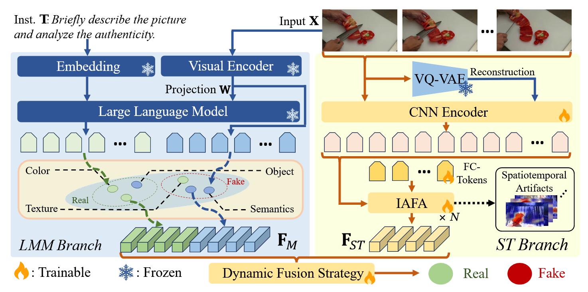 
**模型/方法概述**：  

- 双分支视频伪造检测框架（MM-Det），融合多模态语义与时空特征。  

**核心组件/架构**：  
- **LMM分支**：  
  - 指令+视觉token输入LLaVA，合并LLM输出与视觉token生成多模态伪造表征  
- **ST分支**：  
  - VQ-VAE单次前向传播重建视频  
  - Hybrid-ViT-B编码器处理原始/重建视频  
  - **IAFA机制**：  
    - 为每帧引入FC-Token  
    - 跨帧注意力（所有帧P-tokens） + 帧内注意力（FC-Token与当前帧）  
    - 融合时空位置编码  

**训练策略**：  
- **两阶段训练**：  
  1. 在Rich Forgery Reasoning Dataset上微调LLaVA（自回归损失）  
  2. 冻结LLM，端到端训练ST分支（交叉熵损失）  

**数据集**：  
**DVF数据集**：  
- 3938伪造视频（8种T2V + 1种I2V模型） + 2750真实视频（InternVid-10M/YouTube-8M）  

---

### 7. AIGI-Holmes: Towards Explainable and Generalizable AI-Generated Image Detection via Multimodal Large Language Models  
 
**模型/方法概述**：  

- 融合NPR特征增强的多模态伪造检测框架，支持人类偏好优化。  

**核心组件/架构**：  
- **NPR特征增强**：  ( NPR来自CVPR‘25 Rethinking the Up-Sampling Operations in CNN-based Generative Network for Generalizable Deepfake Detection)
  - NPR模块提取低级视觉伪影特征  
  - MLP投影与CLIP特征融合  
- **三阶段训练**：  
  1. **Visual Expert**：LoRA微调CLIP / NPR+MLP（二元交叉熵）  
  2. **SFT**：冻结CLIP/NPR，训练Projecter+LoRA  
  3. **DPO**：使用偏好数据优化人类对齐  

**数据集**：  
**Holmes-Set**：  
- **Holmes-SFTSet**：MLLM生成的详细图像解释  
- **Holmes-DPOSet**：  
  - *D1*：对比样本 - 优：准确解释 / 劣：矛盾解释  
  - *D2*：专家修正样本 -  优：补充解释（人类专家意见输入DeepseekV3后进行补充） / 劣：（第二阶段训练后模型）原始SFT解释

---

### 8. ALLM4ADD: Unlocking the Capabilities of Audio Large Language Models for Audio Deepfake Detection  
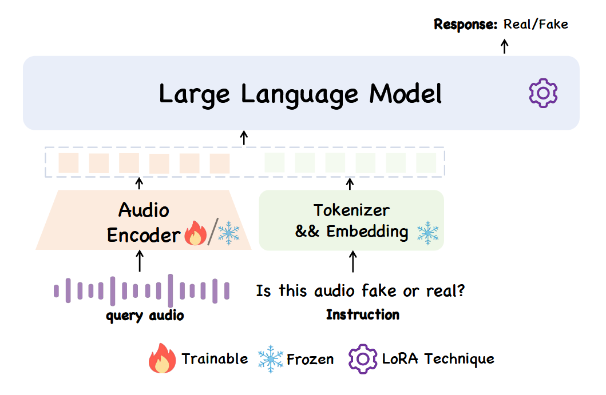 
**模型/方法概述**：  

- 音频大模型驱动的深度伪造音频检测框架。  

**核心组件/架构**：  
- **音频编码器**：Whisper-large-v2/v3提取音频特征  
- **LLM处理**：Qwen-7B/Qwen2-7B系列处理"音频+问题+简易答案"三元组  

**数据集**：  
开源数据集

---

### 9. Spot the Fake: Large Multimodal Model-Based Synthetic Image Detection with Artifact Explanation  
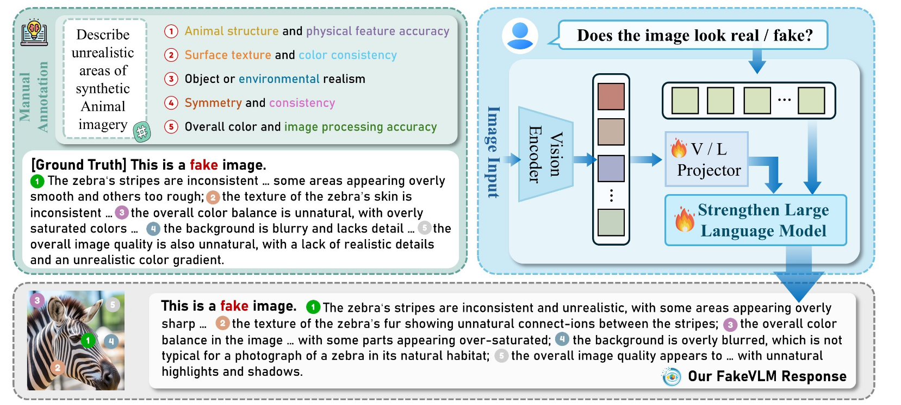

**模型/方法概述**：  

- 基于伪影分析的合成图像检测框架，提供细粒度解释。  

**核心组件/架构**：  

- 如图所示，没有额外设计

**数据集**：  
**FakeClue**（完全合成图像）：  

- 基础数据：GenImage/FF++/Chameleon（80k 1:1真假）  
- 特殊类型：CVUSA/VIGOR/M6Doc + Crossviewdiff/Skydiffusion生成  
- 7类场景分类  
- **伪影分类体系**：  
  - *真实图像*：分析自然光照/物理一致性  
  - *合成图像*：检测纹理/几何/光照/物理伪影  
  - *类别定制*：人脸（边缘融合）、卫星（地理特征）、文档（排版格式）  
- **标注生成**：多LLM投票提取共同点，Qwen2融合组织伪影描述  

---

### 10. VidGuard-R1: AI-Generated Video Detection and Explanation via Reasoning MLLMs and RL  
 
**模型/方法概述**：  

- 基于强化学习的视频伪造检测与解释框架，支持运动/照明/物理一致性分析。  

**核心组件/架构**：  

见训练策略和数据集生成

**训练策略**：  

- **两阶段训练**（Qwen2.5-VL-7B）：  
  1. **SFT**：30k样本训练CoT推理能力  
  2. **RL优化**：  
     - *DPO*：真实/伪造视频对比样本  
     - *GRPO-TA*：注入时间伪影（重复/反转片段），如果模型能正确识别这些被篡改的视频为 fake，则给予**额外奖励**；若篡改自**真实视频**（更难检测），奖励更高；若篡改自**已生成视频**（已有伪影），奖励略低。
     - *GRPO-Q*：若模型不仅能正确分类 fake，还能**估计出大致的DIffusion前向生成步数**（即质量等级），则给予**部分奖励**；

**数据集**：  

**VidGuard**：  

- 真实视频：InternVid/ActivityNet + Qwen2.5-VL 72B生成描述  
- 伪造视频：HunyuanVideo/CogVideoX（输入第一帧+描述生成）  
- 伪造视频与真实视频共享首帧，增强检测挑战性  
- **CoT数据生成**：  
  - 查询运动/照明/纹理/物理合理性  
  - 使用ground-truth标签生成补充线索  

---

### 11. Veritas: Generalizable Deepfake Detection via Pattern-Aware Reasoning  
**模型/方法概述**：  
- 模式感知推理框架，支持跨域泛化和细粒度伪影分析。  

**核心组件/架构**：  

- **推理模式**：5个special token控制推理流程，进行不同层次推理
  - `<FAST>`→`<PLAN>`→`<REASON>`→`<REFLECT>`→`<CONCL>`  

**训练策略**：  
- **两阶段训练**：  
  1. **冷启动SFT**：36K样本，三步标注流程（伪影识别→视觉事实→推理链）  
  2. **MiPO+P-GRPO**：  
     - 混合偏好数据 - 优：正确答案+高质量推理； 劣：正确答案+模糊推理或错误答案
     - 奖励设计
       - 模式感知奖励（是否包含规划和反思，2分）
       - 反思质量奖励
       - 格式奖励  
       - 惩罚：错误答案+反思（-1分）  

**数据集**：  
**HydraFake-100K**：  

- 覆盖4维度：In-Domain, Cross-Model, Cross-Forgery, Cross-Domain  
- 真实数据：LFW/CelebA/FFHQ等8个数据集  
- 伪造数据：开源+自建（Face Relighting/社交媒体清洗）  
- 质量控制：大模型筛选 + 人工检查  
- 数据解释
  - **伪影分类体系**：  
    - 感知结构异常（直接可见）  
    - 微妙低级伪影（需仔细观察）  
    - 物理定律违反（需常识推理） 
  - 多MLLM投票：使用Qwen2.5-VL-72B、Kimi-VL和InternVL3-78B进行集成投票

---

### 12. UniShield: An Adaptive Multi-Agent Framework for Unified Forgery Image Detection and Localization  
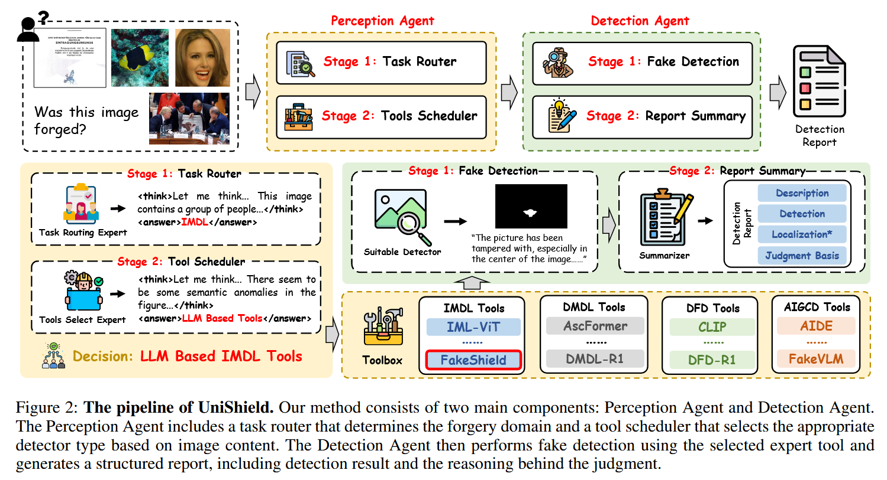

**模型/方法概述**：  

- 多智能体自适应框架，统一处理4类伪造任务（IMDL/DMDL/DFD/AIGCD）。  

**核心组件/架构**：  
- **感知代理**：  
  - *Task Router*：GRPO优化的VLM，用以判断伪造任务类别
  - *Tool Scheduler*：使用Qwen2.5-VL，决策调用LLM-based（语义不一致）或non-LLM-based（低级伪影）工具  
- **检测代理**：  
  - *伪造检测模块*：整合8个专家检测器  
  - *报告生成器*：GPT-4o生成结构化报告（描述/结果/定位/依据）  

**数据集**：  
开源数据集

---

### 13. MIRAGE: Towards AI-Generated Image Detection in the Wild  
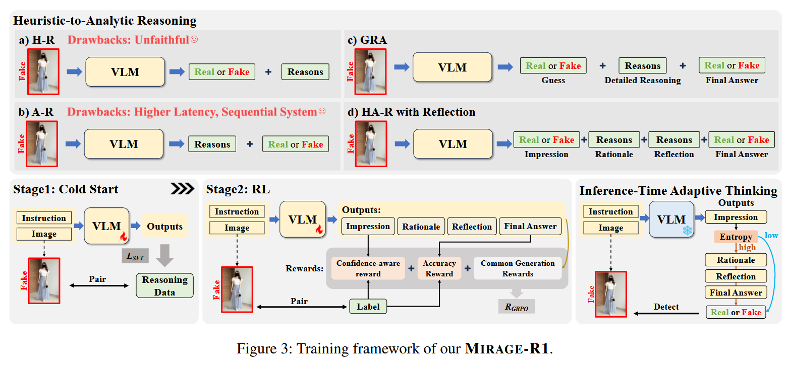

**模型/方法概述**：  

- 两阶段推理框架（HA-R with Reflection），支持不确定性自适应处理。  

**核心组件/架构**：  
- **HA-R推理范式**：  
  - `<Impression>`：快速启发式初始答案  
  - `<Reasons>`：提供初始解释  
  - `<Reflection>`：批判性自我纠正  
  - `<Final Answer>`：稳健最终判断  
- **推理阶段特殊优化**：  
  - 使用初始答案Ai的概率熵衡量置信度以判断是否进行完整HA-R流程  

**训练策略**：  

- **两阶段训练**：  
  1. **SFT冷启动**：LoRA微调Qwen2.5-VL-7B  
  2. **RLVR优化**：  
     - GRPO软奖励函数（避免过度自信）  
     - 综合奖励：准确度+置信度+长度+重复惩罚+格式奖励  

**数据集**：  
**MIRAGE**（真实场景分布）：  
- 8,465真实 + 3,094 AI生成（15k网站数据人工标注）  
- 补充8种生成pipeline + 53个模型生成数据  
- 专家过滤 + QvQ-Max生成文本推理  
- 按分布内/外划分数据集

---

### 14. FakeScope: Large Multimodal Expert Model for Transparent AI-Generated Image Forensics  
**模型/方法概述**：  
- 基于ACoTI策略的伪造分析框架，提供细粒度痕迹证据。  

**核心组件/架构**：  

见训练策略和数据集

**训练策略**：  

- 两套backbone：**LLaVA-v1.5(7B)**和**mPLUG-Owl2**
- 两阶段微调：  
  1. 跨模态对齐（CLIP+LLM）  
  2. FakeInstruct上视觉指令微调  
  3. Token软评分：提取"fake"/"real"位置的token，计算其概率分布以得到置信度便于计算soft loss

**数据集**：  

- **FakeChain**：

  - 人类专家标注50真/50假图像的痕迹类别 （从给定伪影类别中选取解释方向+保留共同选择的类别）

  - **ACoTI策略**

    

    - *引导*：提供痕迹类别集合（纹理/视角等）  
    - *示范*：从专家标注的示例集合中选取相关示例，通过最小覆盖集优化选择代表性示例（至少包含一个正样本和一个负样本）
    - *启发*：生成<context, target, supervision, CoT prompt>四元组  

- **FakeInstruct**：200万条指令数据（Mistral/GPT-4o生成）：  
  - 绝对真实性判断（"fake/real"概念植入）  
  - 整体推理（视觉痕迹→真实性）  
  - 细粒度痕迹证据（叙述/MCQ格式）  
  - 扩展知识讨论  

**基础模型**：  
LLaVA-v1.5(7B) / mPLUG-Owl2  

---

### 15. LEGION: Learning to Ground and Explain for Synthetic Image Detection  
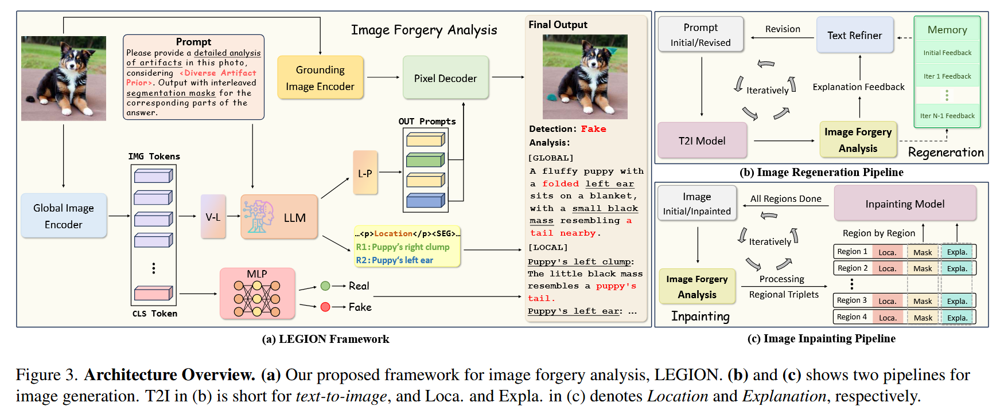

**模型/方法概述**：  

- 伪影定位与解释生成框架，支持图像生成优化应用。  

**核心组件/架构**：  
- **全局-局部协同**：  
  - *全局编码器*：CLIP+MLP二元分类  
  - *LLM分析*：CLIP图像token + 文本prompt + 伪影先验xp（xp是多样化伪影先验，包含三类伪影的常见案例，引导模型从多角度全面检查图像） 
  - *定位模块*：预训练SAM得到区域特征 + LLM标记文本 → 像素解码器 → 伪影掩码  
- **伪影先验(xp)**：包含Physical/Distortion/Structure三类常见案例  

**训练策略**：  

- **两阶段训练**：  
  1. 伪影定位与解释：优化分割性能（LoRA）  
  2. 检测增强：proGAN训练MLP分类器  

**图像生成应用拓展**：  

- 图像生成优化：通过LEGION输出优化再生管道  
- 图像修复：基于伪影掩码局部优化  

**数据集**：  
**SynthScars**：  

- 预训练ResNet-50提取特征后聚类分析，在聚类中均匀采样
- Qwen2-VL-72B过滤低质量样本  
- 人类标注不规则多边形掩码（三类伪影） ，并对掩码进行注释

---

### 16. ThinkFake: Reasoning in Multimodal Large Language Models for AI-Generated Image Detection  
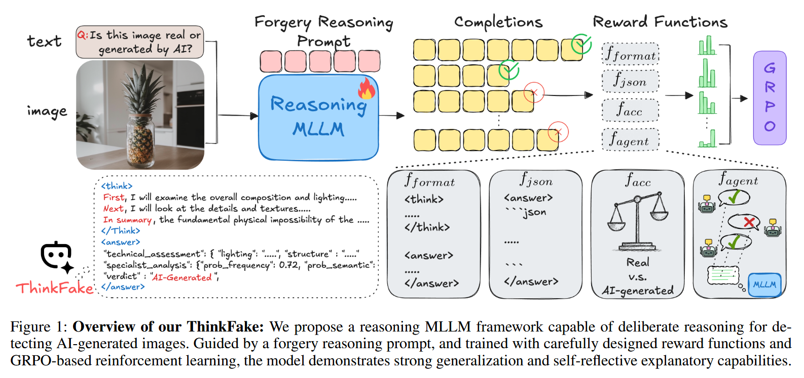

**模型/方法概述**：  

- 五步结构化推理框架，结合多专家代理增强检测鲁棒性。  

**核心组件/架构**：  
- **五步推理流程**（特殊token约束）：  
  1. `<SCANNING>`：快速扫描评估整体和谐度  
  2. `<ANALYSIS>`：检查纹理/光照/阴影/边缘细节  
  3. `<TECHNICAL>`：追踪AI生成伪影（结构/表面不一致）  
  4. `<AUXILIARY>`：三专家视角评估（语义/频率/双流）  
  5. `<JUDGEMENT>`：整合证据输出JSON结构化结论  

**训练策略**：  
- **两阶段训练**：  
  1. **SFT冷启动**：638个高质量标注样本  
  2. **GRPO优化**：  
     - 奖励函数：推理格式/JSON格式/准确性/代理奖励  
     - 其中，代理奖励，集成UnivFD/NPR/AIDE专家模型监督  

**基础模型**：  
Qwen2.5-VL-7B-Instruct  